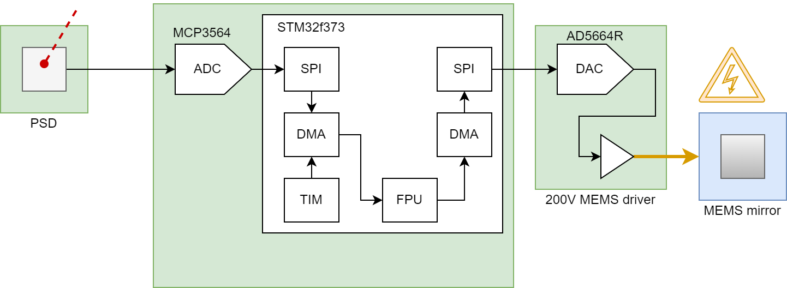

# stm32-wiggly-pointy
stm32f373 firmware for tracking laser error detection on a PSD and downward pointing using a MEMS mirror

---

---

### Tasks

- ✅ test PCB board no. 1
	+ ✅ USART debug communication with PC working
	+ ✅ LEDs working
	+ ✅ SPI, ADC working (responding)
- 🔄 seperate PSD board
	+ ✅ place PSD sensor 
	+ ✅ place potentiometer
	+ 🔘 configure offest voltage
- ✅ **MCP3564** ADC from PSD functionality
	+ ✅ ADC has IRQ data "streaming"
	+ 🔘 calibrate ADC voltage values
	+ 🔘 calibrate PSD position values (**how?**)
- 🔄 **AD5664R** DAC for MEMS mirror functionality
	+ ✅ include DAC library
	+ ✅ generate FCLK for driver board using TIM
	+ ✅ test ⚡️200V⚡️ DC driver without MEMS mirror (sine patterns)
	+ 🔘 test pattern driver with MEMS mirror
	+ 🔘 angle-to-DAC linearization/calibration from mirrorcle datasheet
- 🔘 calibrate full system with laser, PSD and mirror
- 🔘 add watchdog timer if ADC stops working

---

( ✅ 🔄 ⚠️ 🗓 🔘 )

--- 

### Important Notes

Active UART communication severely impacts the signal measured by the ADC.

Using single polling and printing to UART (measure, print, measure, print...) produces 20mVpp errors!!!

Using multiple polling without active UART (measure, measure, measure, print...) produces 1mVpp errors only.

