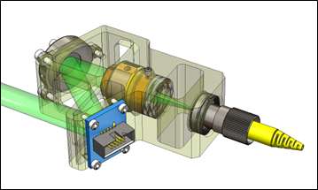
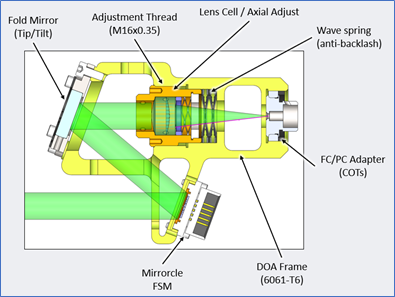
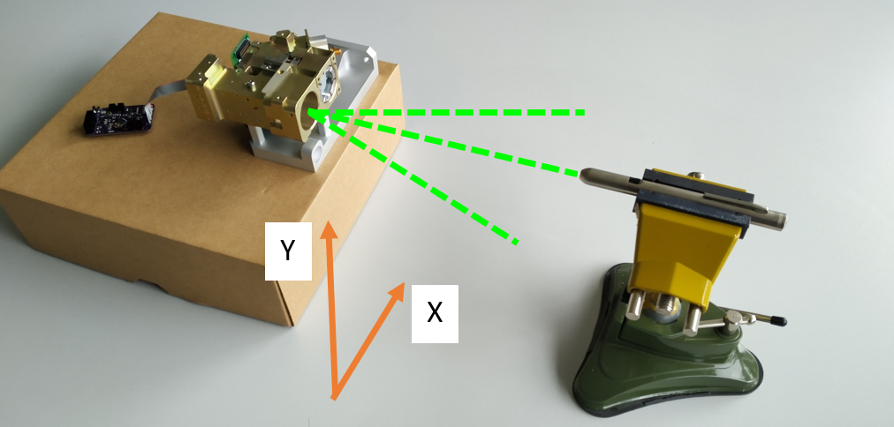
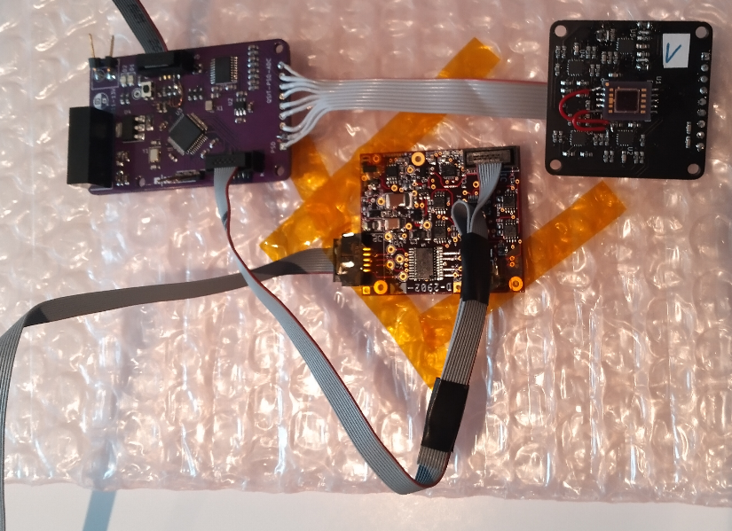
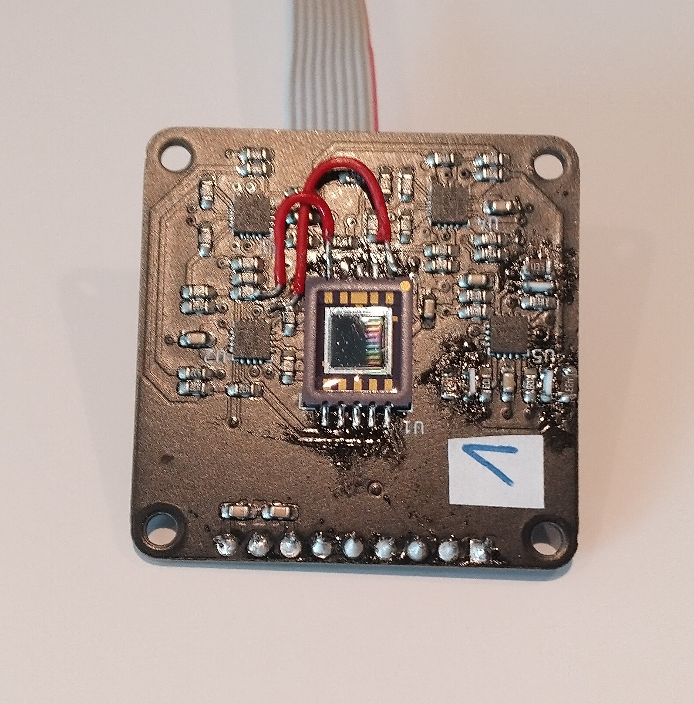
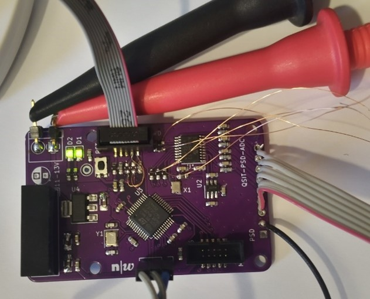

# PSD and MEMS mirror based laser tracking and pointing

stm32f373 firmware for tracking laser error detection on a 2D-Positional Sensitive Photodiode (PSD) and correction of the downward pointing beam using a MEMS micro mirror.
Working in the range of +/- 1°.

---

---

### Hardware

KiCAD:

[fhnw-ise-qcrypt/qsit_psd_payload_module_kicad](https://github.com/fhnw-ise-qcrypt/qsit_psd_payload_module_kicad)

#### MEMS mirror light path

#### Calibration Setup

#### All Circuit Boards

#### Hamamatsu PSD Board

#### Control Board (STM32f373)

---

### Tasks

- ✅ test PCB board no. 1
	+ ✅ USART debug communication with PC working
	+ ✅ LEDs working
	+ ✅ SPI, ADC working (responding)
- ✅ seperate PSD board
	+ ✅ place PSD sensor 
	+ ✅ place potentiometer
	+ ✅ configure offest voltage --> HOW?? any positive voltage 0...5V seems to work
- ✅ **MCP3564** ADC from PSD functionality
	+ ✅ ADC has IRQ data "streaming"
	+ 🔄 calibrate ADC voltage values
	+ 🔄 calibrate PSD position values (**how?**)
- 🔄 **AD5664R** DAC for MEMS mirror functionality
	+ ✅ include DAC library
	+ ✅ generate FCLK for driver board using TIM
	+ ✅ test ⚡️200V⚡️ DC driver without MEMS mirror (sine patterns)
	+ ✅ test pattern driver with MEMS mirror
	+ 🔄 angle-to-DAC linearization/calibration from mirrorcle datasheet --> is this necessary?
- ✅ add watchdog timer if ADC stops working
- 🗓 calibrate full system with laser, PSD and mirror

---

( ✅ 🔄 ⚠️ 🗓 🔘 )

--- 

### Important Notes

Active UART communication severely impacts the signal measured by the ADC.

Using single polling and printing to UART (measure, print, measure, print...) produces 20mVpp errors!!!

Using multiple polling without active UART (measure, measure, measure, print...) produces 1mVpp errors only.

